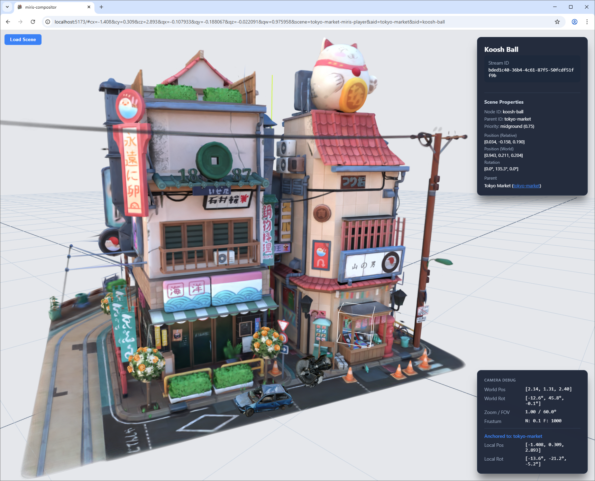

# Miris Compositor Demo

A high-fidelity spatial compositing engine built on the Miris XR streaming platform, three.js, and Vite.


## Overview

This project is a compositing engine capable of:
- **Streaming multiple high-fidelity 3D assets** via Miris XR Web SDK.
- **Hierarchical Asset Positioning**: Assets are placed in a unified three.js scene with relative spatial coordinates (parent-child transforms).
- ~~**Dynamic Priority Scoring**: Calculates real-time priority scores based on distance to camera, asset importance, and depth bands to optimize streaming resources.~~ (Miris SDK support is required for this feature.)
- **Scene Interaction & Focus**: Select assets with a click to center the view, attach the camera to follow moving objects, and see live metadata from the Miris API.
- **URL-based State Persistence**: Save and restore camera position, orientation, anchored assets, and selection state via the browser URL hash. The application is resilient to asset loading failures and will continue to monitor URL changes even if some assets fail to load. Changes in the URL will override `initialCamera` settings in the scene definition.
- **Multi-Key Authentication**: Support for multiple viewer keys and key groups within a single scene (compositor-level implementation). The engine handles scene-level and node-level key overrides.
- **Custom Camera System**: A custom first-person style camera with world/local movement switching, anchoring to assets, and smooth focus transitions.
- **Built-in Animations**: Supports rotations and customizable oscillations (bounce) with configurable directions and clipping behaviors.
- **Modern Workflow**: Fast development using Vite and type-safe development with TypeScript.

## Architecture

The engine is built on the following stack:
- **[Miris XR Web SDK](https://miris.com)**: For adaptive, high-fidelity spatial asset streaming.
- **[three.js](https://threejs.org)**: As the 3D runtime and scene layer.
- **Vite**: For a fast development environment and optimized builds.
- **TypeScript**: For robust, type-safe development.

See the [`/docs`](./docs) folder for detailed documentation:
- [**Architecture**](./docs/architecture.md): Core components and system design.
- [**Scene Definition**](./docs/scene-definition.md): Documentation of the hierarchical scene configuration format.

## Getting Started

### Prerequisites
- Node.js (v18+)
- Access to Miris Public Beta (for streaming capabilities and a valid `VITE_MIRIS_VIEWER_KEY`)

### Configuration
Create a `.env` file in the root directory, using `.env.example` as a template:
```env
VITE_DEFAULT_SCENE=tokyo-market-miris-player
VITE_MIRIS_VIEWER_KEY=your_miris_viewer_key_here
VITE_MIRIS_VIEWER_KEYS='[{"group-a": "key-a"}, {"group-b": "key-b"}]'
```
`VITE_DEFAULT_SCENE` is the ID of the built-in scene to load on startup.  
`VITE_MIRIS_VIEWER_KEY` is the key used to authenticate with Miris.  
`VITE_MIRIS_VIEWER_KEYS` is a JSON array of viewer keys grouped by key groups.

All three properties are optional. The compositor will load an empty scene if `VITE_DEFAULT_SCENE` is not set. `VITE_MIRIS_VIEWER_KEY` or `VITE_MIRIS_VIEWER_KEYS` may be configured in a scene definition file directly, but they are kept private using `.env` files, and different `.env` files can be used for development and production allowing the use of different Viewer Keys. It is advised to use the `.env` appropriate for your application and deployment.

### Installation
1. Clone the repository.
2. Install dependencies:
```bash
npm install
```

### Development
Start the local development server (this updates the built-in scene manifest when launched):
```bash
cp .env.example .env.development.local
npm run dev
```

### Build
Create a production environment before building.  
Generate a production-ready build (this also updates the built-in scene manifest):
```bash
cp .env.example .env.production.local
npm run build
```

To update the scene manifest without a full build:
```bash
npm run generate:scenes
```

Host the site with a service which supports Vite like `serve` or `vercel`.
```bash
npm run serve
```

## Controls

- **Mouse**:
  - **Left-Click**: Rotate the camera.
  - **Right-Click**: Pan the camera.
  - **Scroll Wheel**: Move the camera forward and backwards.

- **Keyboard**:
  - **W**: Move the camera forward.
  - **S**: Move the camera backward.
  - **A**: Move the camera left.
  - **D**: Move the camera right.
  - **ESC**: Unselect the currently selected asset.

- **Asset Selection**:
  - **Double-Click**: Anchor on an asset. This will lock the camera to the asset, and the camera debug panel will show you relative position and orientation.
  - **Left-Click**: Select an asset in the scene. This will highlight the asset, and the asset selection panel will show you the world position and orientation of the selected asset. If anchored to a scene asset, it will also tell you relative position and orientation.

- **Selection Panel**:
  - **ESC**: Unselect the currently selected asset and close the panel.
  - **Asset links**: Following an asset link will center the view on the asset and anchor to it.

## Scene Loading and URL Sharing

The compositor supports dynamic scene loading and state persistence via the URL hash.

### Loading Scenes
- **Built-in Scenes**: Use the **"Load Scene"** button in the top-left corner to choose from a list of pre-configured public scenes.
- **Local Files**: You can also load your own `.json` scene definitions directly from your computer using the same menu.
- **Default Scene**: The application can be configured to load a specific scene on startup using the `VITE_DEFAULT_SCENE` environment variable.

### URL Hash Parameters
You can share your current view or a specific configuration by sharing the URL with its hash parameters.

Example: http://localhost:5173/#scene=tokyo-market-miris-player&aid=tokyo-market&sid=koosh-ball&cx=-1.408&cy=0.309&cz=2.893&qx=-0.107933&qy=-0.188067&qz=-0.022091&qw=0.975958

- **`scene`**: The ID of the **built-in** scene to load (e.g., `tokyo-market-miris-player`).
- **`aid` (Anchor ID)**: The ID of the asset the camera is currently anchored to.
- **`sid` (Selection ID)**: The ID of the asset that is currently selected and highlighted.
- **`cx`, `cy`, `cz`**: Camera world position.
- **`qx`, `qy`, `qz`, `qw`**: Camera orientation as a quaternion.

All parameters are optional, and the application will try to apply them, limiting any need to reload if possible. The `scene` parameter is only applicable to built-in scenes. Custom scene definitions which aren't built into the application will not work with the URL hash. Shortly after moving the camera, or anchoring or selecting an asset, the URL will be updated to provide an URL which can restore the camera and asset selection settings. 

## Documentation & Assets

- [**Architecture**](./docs/architecture.md): Core components and system design.
- [**Scene Definition**](./docs/scene-definition.md): Documentation of the hierarchical JSON scene format.
- [**YouTube - Demo**](https://youtu.be/LOm3WqlUVww)
- **App Screenshot**:
  

## Status

### Active development.

- [x] Initial Vite + TypeScript setup.
- [x] three.js integration.
- [x] Miris Web SDK integration (MirisAdapter & MirisStream).
- [x] Hierarchical Compositing engine logic.
- [x] Built-in Scenes.
- [x] Dynamic JSON Scene Loading.
- [x] Local file import support.
- [x] Scene Interaction & Focus.
- [x] URL state persistence and sharing.
- [x] Animations.
  - [x] Rotation.
  - [x] Bounce oscillation.

### Future enhancements.

- [ ] Scene Management:
  - [ ] Scene editor. 
  - [ ] Scene import/export.
  - [ ] Scene sharing.
  - [ ] Scene collaboration.
- [ ] Asset Management:
  - [ ] Asset import/export.
  - [ ] Asset sharing.
  - [ ] Asset collaboration.
- [ ] Scene & Asset Management:
  - [ ] Scene/Asset metadata.
- [ ] Requires Miris SDK support for:
  - [ ] Asset metadata.
  - [ ] Asset streaming.
  - [ ] Priority-based scoring system.
  - [ ] Multi-Key Authentication.

